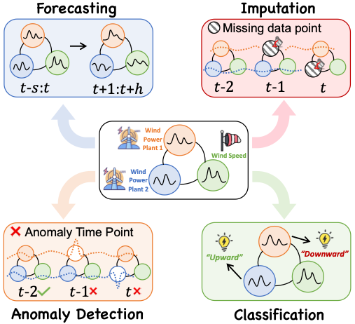
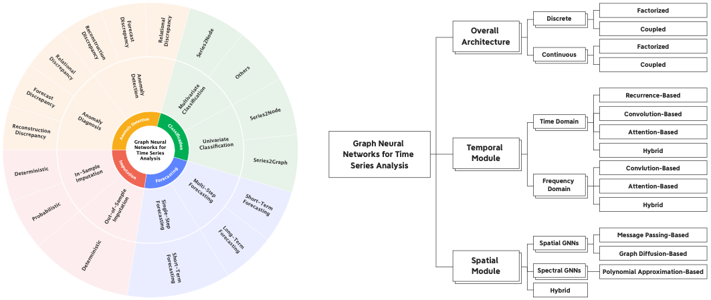

# Awesome-GNN4TS

 

 

Abundant resources related to **GNNs for Time Series Analysis (GNN4TS)** 🔥

Time series analysis is a fundamental task in many real-world applications, such as finance, healthcare, and transportation. Recently, graph neural networks (GNNs) have been widely used in time series analysis. This repository aims to collect the resources related to GNNs for time series analysis (GNN4TS).

We provide two taxonomies for GNN4TS. The first taxonomy (left) is task-oriented and the second taxonomy (right) is model-oriented. The task-oriented taxonomy is based on the tasks that GNNs are used for in time series analysis. The model-oriented taxonomy is based on the types of GNNs used in time series analysis.

## News

- [2023-06-19] 🔥 We have released this repository that collects the resources related to GNNs for time series analysis (GNN4TS). We will keep updating this repository, and welcome to **STAR** and **WATCH** to keep track of it.

## Table of Contents
- [Awesome-GNN4TS](#awesome-gnn4ts)
  - [News](#news)
  - [Related Surveys](#related-surveys)
  - [Collection of Papers](#collection-of-papers)
    - [GNNs for Time Series Forecasting (GNN4TSF)](#gnns-for-time-series-forecasting-gnn4tsf)
    - [GNNs for Time Series Classification (GNN4TSC)](#gnns-for-time-series-classification-gnn4tsc)
    - [GNNs for Time Series Anomaly Detection (GNN4TAD)](#gnns-for-time-series-anomaly-detection-gnn4tad)
    - [GNNs for Time Series Imputation (GNN4TSI)](#gnns-for-time-series-imputation-gnn4tsi)
  - [Collection of Datasets](#collection-of-datasets)
  - [Applications](#applications)

## Related Surveys
- Deep learning for time series classification: a review (Data Mining and Knowledge Discovery, 2019) [[paper]](https://arxiv.org/pdf/1809.04356.pdf)
- Deep Learning for Spatio-Temporal Data Mining: A Survey (TKDE, 2020) [[paper]](https://arxiv.org/pdf/1906.04928.pdf)
- Time Series Data Imputation: A Survey on Deep Learning Approaches (arXiv, 2020) [[paper]]()
- A review on outlier/anomaly detection in time series data (CSUR, 2021) [[paper]](https://arxiv.org/pdf/2011.11347.pdf)
- Time Series Data Augmentation for Deep Learning: A Survey (IJCAI, 2021) [[paper]](https://arxiv.org/abs/2002.12478)
- Graph Neural Network for Traffic Forecasting: A Survey (Expert Syst. Appl., 2022) [[paper]](https://arxiv.org/abs/2101.11174)
- Spatial-temporal graph neural network for traffic forecasting: An overview and open research issues (Appl. Intell., 2022) [[paper]](https://link.springer.com/article/10.1007/s10489-021-02587-w)
- Deep Learning on Traffic Prediction: Methods, Analysis and Future Directions (TITS, 2022) [[paper]](https://arxiv.org/pdf/2004.08555.pdf)
- Graph-based Time-Series Anomaly Detection: A Survey (arXiv, 2023) [[paper]](https://arxiv.org/pdf/2302.00058.pdf)
- Spatio-Temporal Graph Neural Networks for Predictive Learning in Urban Computing: A Survey (arXiv, 2023) [[paper]](https://arxiv.org/abs/2303.14483)
- Spatio-Temporal Graph Neural Networks: A Survey (arXiv, 2023) [[paper]](https://arxiv.org/pdf/2301.10569.pdf)
- Graph Neural Networks in IoT: A Survey (TOSN, 2023) [[paper]](https://dl.acm.org/doi/10.1145/3565973)
- Graph Neural Network for Traffic Forecasting: The Research Progress (ISPRS Int. J. Geo-Inf., 2023) [[paper]](https://www.mdpi.com/2220-9964/12/3/100)

## Collection of Papers

### GNNs for Time Series Forecasting (GNN4TSF)
- Diffusion convolutional recurrent neural network: Data-driven traffic forecasting
- Spatio-temporal graph convolutional networks: A deep learning framework for traffic forecasting
- Urban traffic prediction from spatio-temporal data using deep meta learning
- ST-UNet: A Spatio-Temporal U-Network forGraph-structured Time Series Modeling
- Dynamic Spatial-Temporal Graph Convolutional Neural Networks for Traffic Forecasting
- Graph Attention Recurrent Neural Networks for Correlated Time Series Forecasting
- Attention Based Spatial-Temporal Graph Convolutional Networksfor Traffic Flow Forecasting
- Spatiotemporal Multi-Graph Convolution Network for Ride-hailing Demand Forecasting
- Graph wavenet for deep spatial-temporal graph modeling
- STG2Seq: Spatial-Temporal Graph to Sequence Model for Multi-step Passenger Demand Forecasting
- Multi-Range Attentive Bicomponent Graph Convolutional Network for Traffic Forecasting
- Connecting the Dots: Multivariate Time Series Forecasting with Graph Neural Networks
- Traffic Flow Prediction via Spatial Temporal Graph Neural Network
- Towards Fine-grained Flow Forecasting: A Graph Attention Approach for Bike Sharing Systems
- GMAN: A Graph Multi-Attention Network for Traffic Prediction
- Spatial-Temporal Synchronous Graph Convolutional Networks: A New Framework for Spatial-Temporal Network Data Forecasting
- Spatio-Temporal Graph Structure Learning for Traffic Forecasting
- Spectral Temporal Graph Neural Network for Multivariate Time-series Forecasting
- Adaptive Graph Convolutional Recurrent Network for Traffic Forecasting
- GraphSleepNet: Adaptive Spatial-Temporal Graph Convolutional Networks for Sleep Stage Classification
- LSGCN: Long Short-Term Traffic Prediction with Graph Convolutional Networks
- ST-GRAT: A Novel Spatio-temporal Graph Attention Network forAccurately Forecasting Dynamically Changing Road Speed
- Spatiotemporal Hypergraph Convolution Network for Stock Movement Forecasting
- Forecaster: A Graph Transformer for Forecasting Spatial and Time-Dependent Data
- Spatio-Temporal Graph Transformer Networks for Pedestrian Trajectory Prediction
- Discrete Graph Structure Learning for Forecasting Multiple Time Series
- MTHetGNN: A heterogeneous graph embedding framework for multivariate time series forecasting
- Z-GCNETs: Time Zigzags at Graph Convolutional Networks for Time Series Forecasting
- Spatial-Temporal Graph ODE Networks for Traffic Flow Forecasting
- Spatial-Temporal Fusion Graph Neural Networks for Traffic Flow Forecasting
- Hierarchical Graph Convolution Network for Traffic Forecasting
- Traffic Flow Forecasting with Spatial-Temporal Graph Diffusion Network
- TrafficStream: A Streaming Traffic Flow Forecasting Framework Based on Graph Neural Networks and Continual Learning
- DSTAGNN: Dynamic Spatial-Temporal Aware Graph Neural Network for Traffic Flow Forecasting
- Multivariate Time-Series Forecasting with Temporal Polynomial Graph Neural Networks
- Domain Adversarial Spatial-Temporal Network: A Transferable Framework for Short-term Traffic Forecasting across Cities
- Multivariate Time Series Forecasting with Dynamic Graph Neural ODEs
- Graph Neural Controlled Differential Equations for Traffic Forecasting
- CausalGNN: Causal-Based Graph Neural Networks for Spatio-Temporal Epidemic Forecasting
- Auto-STGCN: Autonomous Spatial-Temporal Graph Convolutional Network Search
- TAMP-S2GCNets: Coupling Time-Aware Multipersistence Knowledge Representation with Spatio-Supra Graph Convolutional Networks for Time-Series Forecasting
- Learning the Evolutionary and Multi-scale Graph Structure for Multivariate Time Series Forecasting
- Pre-training Enhanced Spatial-temporal Graph Neural Network for Multivariate Time Series Forecasting
- Mining Spatio-Temporal Relations via Self-Paced Graph Contrastive Learning
- Regularized Graph Structure Learning with Semantic Knowledge for Multi-variates Time-Series Forecasting
- Long-term Spatio-Temporal Forecasting via Dynamic Multiple-Graph Attention (一种通用add-on)
- FOGS: First-Order Gradient Supervision with Learning-based Graph for Traffc Flow Forecasting (一种通用add-on)
- METRO: A Generic Graph Neural Network Framework for Multivariate Time Series Forecasting
- Adaptive Graph Spatial-Temporal Transformer Network for Traffic Flow Forecasting
- DiffSTG: Probabilistic Spatio-Temporal Graph Forecastingwith Denoising Diffusion Models
- How Expressive are Spectral-Temporal Graph Neural Networks for Time Series Forecasting?
- Spatio-Temporal Meta-Graph Learning for Traffic Forecasting
- Temporal Graph Neural Networks for Irregular Data
- Adaptive Spatiotemporal Transformer Graph Network for Traffic Flow Forecasting by IoT Loop Detectors

### GNNs for Time Series Classification (GNN4TSC)
- Time2Graph: Revisiting Time Series Modeling with Dynamic Shapelets (AAAI, 2020) [[paper]](https://arxiv.org/abs/1911.04143)
- Towards Similarity-Aware Time-Series Classification (SDM, 2022) [[paper]](https://arxiv.org/abs/2201.01413)
- Multivariate Time Series Classification with Hierarchical Variational Graph Pooling (Neural Network, 2022) [[paper]](https://www.sciencedirect.com/science/article/abs/pii/S0893608022002970)
- Graph-Guided Network for Irregularly Sampled Multivariate Time Series (ICLR, 2022) [[paper]](https://arxiv.org/abs/2110.05357)
- Time2Graph+: Bridging Time Series and Graph Representation Learning via Multiple Attentions (TKDE, 2023) [[paper]](https://ieeexplore.ieee.org/document/9477138)
- LB-SimTSC: An Efficient Similarity-Aware Graph Neural Network for Semi-Supervised Time Series Classification (DLG-AAAI, 23) [[paper]](https://arxiv.org/abs/2301.04838)
- An Empirical Study of Graph-Based Approaches for Semi-Supervised Time Series Classification (arXiv, 2023) [[paper]](https://arxiv.org/abs/2104.08153)
- TodyNet: Temporal Dynamic Graph Neural Network for Multivariate Time Series Classification (arXiv, 2023) [[paper]](https://arxiv.org/abs/2304.05078)

### GNNs for Time Series Anomaly Detection (GNN4TAD)
- Multivariate time-series anomaly detection via graph attention network (ICDM, 2020) [[paper]](https://arxiv.org/abs/2009.02040)
- Graph Neural Network-Based Anomaly Detection in Multivariate Time Series (AAAI, 2021) [[paper]](https://arxiv.org/abs/2106.06947)
- Learning Graph Structures with Transformer for Multivariate Time Series Anomaly Detection in IoT (IEEE IoT, 2021) [[paper]](https://arxiv.org/abs/2104.03466)
- Time-Series Event Prediction with Evolutionary State Graph (WSDM, 2021) [[paper]](https://arxiv.org/abs/1905.05006)
- Consistent anomaly detection and localization of multivariate time series via cross-correlation graph-based encoder–decoder gan. (IEEE TIM, 2021) [[paper]](https://ieeexplore.ieee.org/document/9666863)
- Graph-augmented normalizing flows for anomaly detection of multiple time series (ICLR, 2022) [[paper]](https://arxiv.org/abs/2202.07857)
- Grelen:Multivariate time series anomaly detection from the perspective of graph relational learning (IJCAI, 2022) [[paper]](https://www.ijcai.org/proceedings/2022/0332.pdf)
- Deep variational graph convolutional recurrent network for multivariate time series anomaly detection. (ICML, 2022) [[paper]](https://proceedings.mlr.press/v162/chen22x.html)
- Learning Sparse Latent Graph Representations for Anomaly Detection in Multivariate Time Series (KDD, 2022) [[paper]](https://dl.acm.org/doi/10.1145/3534678.3539117)
- GTAD: Graph and Temporal Neural Network for Multivariate Time Series Anomaly Detection (Entropy, 2022) [[paper]](https://www.mdpi.com/1099-4300/24/6/759)
- Hypergraph Learning based Recommender System for Anomaly Detection, Control and Optimization (IEEE Big Data, 2023) [[paper]](https://ieeexplore.ieee.org/document/10020888)
- Hybrid anomaly detection via multihead dynamic graph attention networks for multivariate time series (IEEE Access, 2022) [[paper]](https://ieeexplore.ieee.org/document/9758699)
- Graph convolutional adversarial networks for spatiotemporal anomaly detection. (IEEE TNNLS, 2022) [[paper]](https://ieeexplore.ieee.org/document/9669110)
- Multivariate Time Series Anomaly Detection via Dynamic Graph Forecasting (arXiv, 2023) [[paper]](https://arxiv.org/abs/2302.02051)
- Time Series Subsequence Anomaly Detection via Graph Neural Networks (OpenReview, 2023) [[paper]](https://openreview.net/forum?id=73U_NlKaNx) 
- VARIATIONAL ADAPTIVE GRAPH TRANSFORMER FOR MULTIVARIATE TIME SERIES MODELING (OpenReview, 2023) [[paper]](https://openreview.net/forum?id=PWWW73yQVp)
- A CAUSAL APPROACH TO DETECTING MULTIVARIATE TIME-SERIES ANOMALIES AND ROOT CAUSES (arXiv, 2023) [[paper]](https://arxiv.org/abs/2206.15033)

### GNNs for Time Series Imputation (GNN4TSI)
- Inductive Graph Neural Networks for Spatiotemporal Kriging
- Spatial-temporal traffic data imputation via graph attention convolutional network
- Spatial Aggregation and Temporal Convolution Networks for Real-time Kriging
- Dynamic Spatiotemporal Graph Convolutional Neural Networks for Traffic Data Imputation with Complex Missing Patterns
- Filling the G_ap_s: Multivariate Time Series Imputation by Graph Neural Networks
- Learning to Reconstruct Missing Data from Spatiotemporal Graphs with Sparse Observations
- Forecasting Unobserved Node States With Spatiotemporal Graph Neural Networks
- Adaptive Graph Recurrent Network for Multivariate Time Series Imputation
- A Multi-Attention Tensor Completion Network for Spatiotemporal Traffic Data Imputation
- PriSTI: A Conditional Diffusion Framework for Spatiotemporal Imputation
- Dynamic graph convolutional recurrent imputation network for spatiotemporal traffic missing data
- Bidirectional spatial–temporal traffic data imputation via graph attention recurrent neural network
- Memory-augmented dynamic graph convolution networks for traffic data imputation with diverse missing patterns
- Large-Scale Traffic Data Imputation with Spatiotemporal Semantic Understanding

## Collection of Datasets
To be continued...

## Applications

### Healthcare
- GraphConvLSTM: Spatiotemporal Learning for Activity Recognition with Wearable Sensors (GLOBECOM, 2019) [[paper]](https://ieeexplore.ieee.org/document/9013934)
- Graph temporal ensembling based semi-supervised convolutional neural network with noisy labels for histopathology image analysis (Medical Image Analysis, 2020) [[paper]](https://www.sciencedirect.com/science/article/abs/pii/S1361841519301604)
- GraphSleepNet: Adaptive Spatial-Temporal Graph Convolutional Networks for Sleep Stage Classification (IJCAI, 2020) [[paper]](https://www.ijcai.org/proceedings/2020/184)
- Graph neural network-based diagnosis prediction (Big Data, 2020) [[paper]](https://www.liebertpub.com/doi/10.1089/big.2020.0070)
- A hybrid method of recurrent neural network and graph neural network for next-period prescription prediction (International Journal of Machine Learning and Cybernetics, 2020) [[paper]](https://link.springer.com/article/10.1007/s13042-020-01155-x)
- GATE: graph-attention augmented temporal neural network for medication recommendation (Access, 2020) [[paper]](https://ieeexplore.ieee.org/document/9134772)
- Knowledge guided diagnosis prediction via graph spatial-temporal network (SDM, 2020) [[paper]](https://epubs.siam.org/doi/10.1137/1.9781611976236.3)
- Multi-view spatial-temporal graph convolutional networks with domain generalization for sleep stage classification (TNSRE, 2021) [[paper]](https://arxiv.org/abs/2109.01824)
- Interpretable temporal graph neural network for prognostic prediction of Alzheimer's disease using longitudinal neuroimaging data (BIBM, 2021) [[paper]](https://ieeexplore.ieee.org/document/9669504)
- Forecasting ambulance demand with profiled human mobility via heterogeneous multi-graph neural networks (ICDE, 2021) [[paper]](https://ieeexplore.ieee.org/document/9458623)
- Self-Supervised Graph Neural Networks for Improved Electroencephalographic Seizure Analysis (ICLR, 2022) [[paper]](https://arxiv.org/abs/2104.08336)
- CausalGNN: Causal-Based Graph Neural Networks for Spatio-Temporal Epidemic Forecasting (AAAI, 2022) [[paper]](https://ojs.aaai.org/index.php/AAAI/article/view/21479)
- Temporal Multiresolution Graph Neural Networks For Epidemic Prediction (arXiv, 2022) [[paper]](https://arxiv.org/abs/2205.14831)
- Graph-Guided Network for Irregularly Sampled Multivariate Time Series (ICLR, 2022) [[paper]](https://arxiv.org/abs/2110.05357)
- Spatio-temporal fusion attention: A novel approach for remaining useful life prediction based on graph neural network (TIM, 2022) [[paper]](https://ieeexplore.ieee.org/document/9801529)
- Combining graph neural networks and spatio-temporal disease models to improve the prediction of weekly COVID-19 cases in Germany (Scientific Reports, 2022) [[paper]](https://www.nature.com/articles/s41598-022-07757-5)
- Using Ubiquitous Mobile Sensing and Temporal Sensor-Relation Graph Neural Network to Predict Fluid Intake of End Stage Kidney Patients (IPSN, 2022) [[paper]](https://conferences.computer.org/cpsiot/pdfs/IPSN2022-6R1M30NXCSXmbVKUqzz1Of/962400a286/962400a286.pdf)
- Predicting COVID-19 pandemic by spatio-temporal graph neural networks: A New Zealand's study (arXiv, 2022) [[paper]](https://arxiv.org/abs/2305.07731)
- Self-supervised learning for anomalous channel detection in eeg graphs: Application to seizure analysis (AAAI, 2023) [[paper]](https://arxiv.org/abs/2208.07448)

### Smart Transportation
- Diffusion convolutional recurrent neural network: Data-driven traffic forecasting
- Spatio-temporal graph convolutional networks: A deep learning framework for traffic forecasting
- Urban traffic prediction from spatio-temporal data using deep meta learning
- Multi-Range Attentive Bicomponent Graph Convolutional Network for Traffic Forecasting
- Traffic Flow Prediction via Spatial Temporal Graph Neural Network
- GMAN: A Graph Multi-Attention Network for Traffic Prediction
- Spatio-Temporal Graph Structure Learning for Traffic Forecasting
- Adaptive Graph Convolutional Recurrent Network for Traffic Forecasting
- ST-GRAT: A Novel Spatio-temporal Graph Attention Network forAccurately Forecasting Dynamically Changing Road Speed
- Spatial-Temporal Graph ODE Networks for Traffic Flow Forecasting
- Spatial-Temporal Fusion Graph Neural Networks for Traffic Flow Forecasting
- Hierarchical Graph Convolution Network for Traffic Forecasting
- TrafficStream: A Streaming Traffic Flow Forecasting Framework Based on Graph Neural Networks and Continual Learning
- Dynamic Spatiotemporal Graph Convolutional Neural Networks for Traffic Data Imputation with Complex Missing Patterns
- A deep learning approach for flight delay prediction through time-evolving graphs.
- Dynstgat: Dynamic spatial-temporal graph attention network for traffic signal control
- DSTAGNN: Dynamic Spatial-Temporal Aware Graph Neural Network for Traffic Flow Forecasting
- Domain Adversarial Spatial-Temporal Network: A Transferable Framework for Short-term Traffic Forecasting across Cities
- Graph Neural Controlled Differential Equations for Traffic Forecasting
- FOGS: First-Order Gradient Supervision with Learning-based Graph for Traffc Flow Forecasting
- Adaptive Graph Spatial-Temporal Transformer Network for Traffic Flow Forecasting
- A Multi-Attention Tensor Completion Network for Spatiotemporal Traffic Data Imputation
- SGDAN: A spatio-temporal graph dual-attention neural network for quantified flight delay prediction
- Spatio-Temporal Meta-Graph Learning for Traffic Forecasting
- Dynamic graph convolutional recurrent imputation network for spatiotemporal traffic missing data
- Bidirectional spatial–temporal traffic data imputation via graph attention recurrent neural network
- Memory-augmented dynamic graph convolution networks for traffic data imputation with diverse missing patterns
- STGSA: A Novel Spatial-Temporal Graph Synchronous Aggregation Model for Traffic Prediction
- Spatial–Temporal Complex Graph Convolution Network for Traffic Flow Prediction
- Long Short-Term Fusion Spatial-Temporal Graph Convolutional Networks for Traffic Flow Forecasting
- Traffic Flow Forecasting in the COVID-19: A Deep Spatial-Temporal Model Based on Discrete Wavelet Transformation
- Trajectory prediction for autonomous driving based on multiscale spatial‐temporal graph
- Predictive Neural Motion Planner for Autonomous Driving Using Graph Networks
- SAT-GCN: Self-attention graph convolutional network-based 3D object detection for autonomous driving
- Large-Scale Traffic Data Imputation with Spatiotemporal Semantic Understanding

### On-Demand Services
- Deep multi-view spatial-temporal network for taxi demand prediction
- Spatiotemporal Multi-Graph Convolution Network for Ride-hailing Demand Forecasting
- STG2Seq: Spatial-Temporal Graph to Sequence Model for Multi-step Passenger Demand Forecasting
- Spatio-temporal graph convolutional and recurrent networks for citywide passenger demand prediction
- Graph convolutional network approach applied to predict hourly bike-sharing demands considering spatial, temporal, and global effects
- Towards Fine-grained Flow Forecasting: A Graph Attention Approach for Bike Sharing Systems
- Multi-task spatial-temporal graph attention network for taxi demand prediction
- Residential Electric Load Forecasting via Attentive Transfer of Graph Neural Networks
- A comparative study of using spatial-temporal graph convolutional networks for predicting availability in bike sharing schemes
- Multi-community passenger demand prediction at region level based on spatio-temporal graph convolutional network
- Demand prediction for a public bike sharing program based on spatio-temporal graph convolutional networks
- Uncertainty Quantification of Sparse Travel Demand Prediction with Spatial-Temporal Graph Neural Networks
- Graph2Route: A Dynamic Spatial-Temporal Graph Neural Network for Pick-up and Delivery Route Prediction
- Short-term prediction of bike-sharing demand using multi-source data: a spatial-temporal graph attentional LSTM approach
- Coupling graph deep learning and spatial-temporal influence of built environment for short-term bus travel demand prediction
- A data-driven spatial-temporal graph neural network for docked bike prediction
- Multi-Attribute Spatial-temporal Graph Convolutional Network for Taxi Demand Forecasting
- A graph-attention based spatial-temporal learning framework for tourism demand forecasting
- On region-level travel demand forecasting using multi-task adaptive graph attention network

### Environment & Sustainable Energy
- Spatio-temporal graph deep neural network for short-term wind speed forecasting
- M2GSNet: Multi-Modal Multi-Task Graph Spatiotemporal Network for Ultra-Short-Term Wind Farm Cluster Power Prediction
- Superposition graph neural network for offshore wind power prediction
- Spatio-temporal graph neural networks for multi-site PV power forecasting
- Spatiotemporal graph neural network for performance prediction of photovoltaic power systems.
- A graph neural network based deep learning predictor for spatio-temporal group solar irradiance forecasting
- Forecasting PM2. 5 using hybrid graph convolution-based model considering dynamic wind-field to offer the benefit of spatial interpretability
- Forecasting Global Weather with Graph Neural Networks
- Promoting wind energy for sustainable development by precise wind speed prediction based on graph neural networks
- Short-term wind power prediction via spatial temporal analysis and deep residual networks
- A robust spatio‐temporal prediction approach for wind power generation based on spectral temporal graph neural network
- Interpretable deep learning models for hourly solar radiation prediction based on graph neural network and attention
- A new ensemble spatio-temporal PM2. 5 prediction method based on graph attention recursive networks and reinforcement learning
- Short-term wind speed forecasting based on spatial-temporal graph transformer networks
- Optimal Graph Structure based Short-term Solar PV Power Forecasting Method Considering Surrounding Spatio-temporal Correlations
- Condition monitoring of wind turbines with the implementation of spatio-temporal graph neural network
- Cost-effective fault diagnosis of nearby photovoltaic systems using graph neural networks
- Maximising Weather Forecasting Accuracy through the Utilisation of Graph Neural Networks and Dynamic GNNs
- Spatiotemporal air pollution forecasting in houston-TX: a case study for ozone using deep graph neural networks

### Internet of Things
- Joint interaction and trajectory prediction for autonomous driving using graph neural network (arXiv, 2019) [[paper]](https://arxiv.org/abs/1912.07882)
- Semi-supervised hierarchical recurrent graph neural network for city-wide parking availability prediction. (AAAI, 2020) [[paper]](https://arxiv.org/abs/1911.10516)
- Multiscale Spatio-Temporal Graph Neural Networks for 3D Skeleton-Based Motion Prediction (IEEE-TIP, 2021) [[paper]](https://arxiv.org/abs/2108.11244)
- Making Offensive Play Predictable - Using a Graph Convolutional Network to Understand Defensive Performance in Soccer (2021) [[paper]](https://www.researchgate.net/publication/350820443_Making_Offensive_Play_Predictable_-Using_a_Graph_Convolutional_Network_to_Understand_Defensive_Performance_in_Soccer)
- Learning Graph Structures with Transformer for Multivariate Time Series Anomaly Detection in IoT (IEEE IoT, 2021) [[paper]](https://arxiv.org/abs/2104.03466)
- Graph Neural Networks for Anomaly Detection in Industrial Internet of Things (IEEE IoT, 2021) [[paper]](https://ieeexplore.ieee.org/document/9471816)
- Attentional-gcnn: Adaptive pedestrian trajectory pre- diction towards generic autonomous vehicle use cases (IEEE ICRA, 2021) [[paper]](https://ieeexplore.ieee.org/document/9561480)
- Dignet: Learning scalable self-driving policies for generic traffic scenarios with graph neural network (IEEE IROS, 2021) [[paper]](https://ieeexplore.ieee.org/document/9636376)
- Detection	of tactical	patterns using semi-supervised graph neural	networks (MIT Sloan Sports Analytics Conference, 2022) [[paper]](https://www.researchgate.net/publication/359079429_Detection_of_tactical_patterns_using_semi-supervised_graph_neural_networks)
- Who You Play Affects How You Play: Predicting Sports Performance Using Graph Attention Networks With Temporal Convolution (arXiv, 2023) [[paper]](https://arxiv.org/abs/2303.16741)

### Fraud Detection
- TIES: Temporal Interaction Embeddings For Enhancing Social Media Integrity At Facebook (KDD, 2020) [[paper]](https://arxiv.org/abs/2002.07917)
- Early Anomaly Detection by Learning and Forecasting Behavior (arXiv, 2021) [[paper]](https://www.researchgate.net/profile/Tong-Zhao-20/publication/344780238_Early_Anomaly_Detection_by_Learning_and_Forecasting_Behavior/links/5f924b9d458515b7cf96b321/Early-Anomaly-Detection-by-Learning-and-Forecasting-Behavior.pdf)
- Recurrent Graph Neural Networks for Rumor Detection in Online Forums (arXiv, 2021) [[paper]](https://arxiv.org/abs/2108.03548)
- Temporal Graph Representation Learning for Detecting Anomalies in E-payment Systems (ICDMW, 2021) [[paper]](https://ieeexplore.ieee.org/abstract/document/9680052)
- Temporal-aware graph neural network for credit risk prediction (arXiv, 2021) [[paper]](https://arxiv.org/abs/2108.03548)
- TeGraF: temporal and graph based fraudulent transaction detection framework (ICAIF, 2021) [[paper]](https://dl.acm.org/doi/10.1145/3490354.3494383)
- What Happens Behind the Scene? Towards Fraud Community Detection in E-Commerce from Online to Offline (WWW, 2021) [[paper]](https://dl.acm.org/doi/10.1145/3442442.3451147)
- Temporal Debiasing using Adversarial Loss based GNN architecture for Crypto Fraud Detection (ICMLA, 2021) [[paper]](https://ieeexplore.ieee.org/document/9680261)
- APAN: Asynchronous Propagation Attention Network for Real-time Temporal Graph Embedding (SIGMOD/PODS, 2021) [[paper]](https://arxiv.org/abs/2011.11545)
- Graph Neural Networks in Real-Time Fraud Detection with Lambda Architecture (arXiv, 2021) [[paper]](https://arxiv.org/abs/2110.04559) 
- Graph Neural Network for Fraud Detection via Spatial-Temporal Attention (TKDE, 2022) [[paper]](https://ieeexplore.ieee.org/abstract/document/9204584)
- A Novel Spatiotemporal Prediction Approach Based on Graph Convolution Neural Networks and Long Short-Term Memory for Money Laundering Fraud (Arabian Journal for Science and Engineering, 2022) [[paper]](https://link.springer.com/article/10.1007/s13369-021-06116-2)
- Towards Fine-Grained Reasoning for Fake News Detection (AAAI, 2022) [[paper]](https://arxiv.org/abs/2110.15064)
- Modelling graph dynamics in fraud detection with "Attention" (arXiv, 2022) [[paper]](https://arxiv.org/abs/2204.10614)
- TTAGN:Temporal Transaction Aggregation Graph Network For Ethereum Phishing Scams Detection (WWW, 2022) [[paper]](https://arxiv.org/abs/2204.13442)
- Multi-view Heterogeneous Temporal Graph Neural Network for “Click Farming” Detection (PRICAI, 2022) [[paper]](https://dl.acm.org/doi/abs/10.1007/978-3-031-20862-1_11)
- BRIGHT - Graph Neural Networks in Real-time Fraud Detection (CIKM, 2022) [[paper]](https://arxiv.org/abs/2110.04559)
- Exploiting Spatial-Temporal Behavior Patterns for Fraud Detection in Telecom Networks (TDSC, 2022) [[paper]](https://ieeexplore.ieee.org/document/9983508)
- Medical Insurance Fraud Detection using Graph Neural Networks with Spatio-temporal Constraints (Journal of Network Intelligence, 2022) [[paper]](https://bit.kuas.edu.tw/~jni/2022/vol7/s2/14.JNI0311.pdf)

